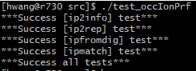
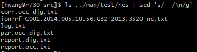
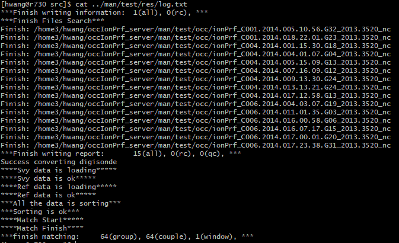

# 概述
本项目提供了用于处理电离层掩星数据文件的Linux命令工具集

# 安装
1. 进入安装包`src`目录
```bash
$ cd ./occIonPrf/src
```

2. 配置路径参数
```bash
$ source ./configure
```

3. 编译
```bash
$ make
```

4. 安装
```bash
$ make install
```

5. 删除临时文件
```bash
$ make clean
```

6. 测试
```bash
$ ./test_occIonPrf
```

若安装成功，则测试脚本将在终端输出：

同时`man/test/res/`目录下将生成以下文件：

其中`log.txt`内容应如下：


# 使用
程序     | 功能
-------- | -----------------------------------------------------------------------------------
ip2info  | 单个或批量提取电离层掩星EDP文件中的廓线序列，将重要参数转化为统一的report格式
ip2rep   | 单个或批量对电离层掩星EDP文件进行自定义质量检核，将重要参数转化为统一的report格式
pfromdig | 单个或批量将垂测仪观测资料转化为统一的report格式
ipmatch  | 针对两个report文件进行自定义时空匹配，并获取匹配组的统计特征

具体用法详见：[参考手册](./doc/参考手册.md)

# 注意
1. 安装本项目前请确保环境中已安装`Netcdf`(C和C++)，其中`Netcdf`(C++)的版本需在4.0及以上
[Netcdf下载](https://www.unidata.ucar.edu/downloads/netcdf/index.jsp)
2. 本项目采用MIT协议，详见: [LICENSE](LICENSE) 