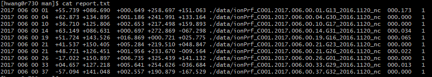
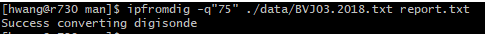
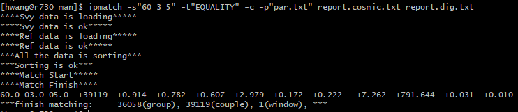

# ip2info
## 主要功能
&emsp;&emsp;单个或批量提取电离层掩星EDP文件中的廓线序列，将重要参数转化为统一的report格式

## 命令格式
&emsp;&emsp;**ip2info &emsp; [选项] &emsp; 输入文件/目录 &emsp; [输出目录]**

## 参数说明
+ **[选项] :** 设置具体功能
+ **输入文件/目录 :** 设置输入文件名或目录
+ **[输出目录] :** 设置输出目录
	+ 缺省时默认输出到当前目录下
	+ 输出文件名统一命名格式：输入文件名+`.txt`
	+ 输出文件格式如下：
	   1. 文件头： 掩星事件的重要参数信息，共7行，每行参数间以空格分隔
	       1. 时间：年，年积日，时，分。
		   2. 位置：纬度，经度
		   3. 峰值参数：峰值密度，峰值高度，峰值方位角
		   4. 文件目录
		   5. 文件名为输入文件名
		   6. 电子密度廓线序列的参数顺序和单位
		   7. 文件头结束标志
	   2. 数据区域：电子密度廓线序列

## 选项列表
+ **-d :** 设置输入为目录，搜索该目录全部文件进行处理
   + `-d`缺省时默认输入为文件
+ **-a [目录名;目录子结构;方位角数值范围类型]:** 设置掩星平面方位角计算所需的相位文件信息
   + `-a`缺省时默认独立计算方位角。
   + 目录名为相位文件IEG所在目录，用于反演掩星平面方位角
      + `#`表示辅助文件与EDP文件在同一目录
	  + 只需设置目录即可，IEG和EDP的同一掩星事件匹配将由程序自动进行
   + 目录结构为相位文件所在目录的命名结构。
      + `*`表示子结构按照标准格式`year/year.doy`构建，如`2018/2018.001`
	  + `|`表示子结构按照半标准格式`year.doy`构建，如`2018.001`
	  + 此区域缺省时默认标准子结构
   + 方位角数值范围类型有两种
      + `0`或此区域缺省表示取值范围为`[-180, 180)`
	  + `1`表示取值范围为`[0, 180)`
   + 处理COSMIC的EDP文件时，方位角在EDP中直接提供，因此将忽略此选项
   + 处理FY-3C的EDP文件，方位角在EDP中不提供，因此必须指定相位文件IEG，否则方位角设置为999

## 注意事项
&emsp;&emsp;无

## 参考示例
1. 处理当前目录下的`ionPrf_C001.2017.006.00.41.G05_2016.1120_nc`文件，结果保存到当前目录
```bash
$ ip2info ./ionPrf_C001.2017.006.00.41.G05_2016.1120_nc
```

成功执行后，终端将出现如下提示：  
  
输出文件内容如下：  
  

2. 处理目录`data`中的全部文件，结果保存到`result`目录
```bash
$ ip2info -d ./data ./result
```

成功执行后，终端将出现如下提示：  
  
`result`目录生成文件如下，与`data`中文件一一对应  
  

***
***

# ip2rep
## 主要功能
&emsp;&emsp;单个或批量对电离层掩星EDP文件进行自定义质量检核，将重要参数转化为统一的report格式

## 命令格式
&emsp;&emsp;**ip2rep &emsp; [选项] &emsp; 输入文件/目录 &emsp; [输出文件]**

## 参数说明
+ **[选项] :** 设置具体功能
+ **输入文件/目录 :** 设置输入文件名或目录
+ **[输出文件] :** 设置输出文件名
	+ 缺省时默认输出到终端
	+ 输出文件格式：各列以空格分隔
		1. 时间：第1~4列，依次为年，年积日，时分，分
		2. 位置：第5~6列，依次为纬度，经度
		3. 峰值参数：第7~8列，依次为峰值密度，峰值高度，峰值方位角
		4. 文件完整路径：第9列
		5. 质量检核指标：第10~15列，依次为平均相对偏差(MD)，噪声水平因子(sigma)，全局斜率(gk)，局部斜率(lk)，检核标志（1表示通过，0表示不通过）
	+ 是否进行质量检核以及选用何种检核指标都是可自定义的，因此第10~15列是可变的，取决于选项设置
	
## 选项列表
+ **-m [窗口大小]:** 启用平均相对偏差质量检核指标
	+ 缺省时默认为9
+ **-d:** 启用噪声水平因子质量检核指标
+ **-g:** 启用全局斜率质量检核指标
+ **-l [高度区间]:** 启用局部斜率质量检核指标
	+ 缺省时默认为[420, 490]km
+ **-w [窗口大小;高度区间]:** 启用全部质量检核指标
	+ 缺省时默认为9和[420, 490]km
+ **-i:** 不输出含有无效值的结果，如INF, NAN等
+ **-q [MD区间;sigma区间;gk区间;lk区间;NmF2区间;hmF2区间;AmF2区间]:** 不输出未在合格区间的结果
	+ 缺省时默认0<=MD<=0.1, 0<=sigma<=0.05, gk<0, lk<0, 0<=NmF2<=20, 200<=hmF2<=500, AmF2不限
	+ 必须开启相应质量检核指标后`-q`设置区间才有效，否则将忽略区间设置，默认该指标合格
	+ `-q`的功能覆盖`-i`，即设置`-q`后，无效值也视为不通过质量检核
	+ `-q`的位置建议放在质量指标选项之后，如`-w -q`
+ **-d :** 设置输入为目录，搜索该目录全部文件进行处理
   + `-d`缺省时默认输入为文件
+ **-a [目录名;目录子结构;方位角数值范围类型]:** 设置掩星平面方位角计算所需的相位文件信息
	+ 与`ip2info`中`-a`选项相同
	
## 注意事项
&emsp;&emsp;无

## 参考示例
1. 处理目录`data`中的全部文件，结果保存到文件`report.txt`中，不启用质量控制
```bash
$ ip2rep -d ./data report.txt
```
成功执行后，终端将出现如下提示：  
  
输出文件内容如下：  
  

2. 处理目录`data`中的全部文件，结果保存到文件`report.txt`中，启用平均相对偏差指标，滑动窗口为11，合格范围自定义为[0,1.5]
```bash
$ ip2rep -d -m"11" -q"0 1.5;;;;;;" ./data report.txt
```

成功执行后，终端提示同上  
输出文件内容如下，未通过检核的结果不出现在文件中，而是输出到终端  
  

3. 处理目录`data`中的全部文件，结果保存到文件`report.txt`中，启用全部质量指标，采用默认合格范围，输出所有结果
```bash
$ ip2rep -d -w ./data report.txt
```

成功执行后，终端提示同上  
输出文件内容如下，未通过检核的结果出现在文件中，但标志位为0  
  

***
***
	
# ipfromdig
## 主要功能
&emsp;&emsp;单个或批量将垂测仪观测资料转化为统一的report格式

## 命令格式
&emsp;&emsp;**ipfromdig &emsp; [选项] &emsp; 输入文件/目录 &emsp; [输出文件]**

## 参数说明
+ **[选项] :** 设置具体功能
+ **输入文件/目录 :** 设置输入文件名或目录
	+ 输入文件名前5个字符必须是测站ID
	+ 输入文件由SAO-explore软件连接垂测仪数据库DIDB导出
+ **[输出文件] :** 设置输出文件名
	+ 缺省时采用默认命名方式
	+ 输入为目录时，此项必须缺省，采用默认命名方式
	+ 输入为目录时，输出结果保存到输入目录下，与输入文件一一对应
	
## 选项列表
+ **-d :** 设置输入为目录，搜索该目录全部文件进行处理
   + `-d`缺省时默认输入为文件
+ **-q [CS值] :** 设置最低可接受的CS值
	+ `-q`缺省时默认CS=90
	+ CS值是输入文件中自带的评估垂测仪自动标定质量的参数
	+ CS值取值范围：[0, 100]，值越大精度越高
	+ CS=999时表示手动标定，一般情况手动标定优于自动标定
   
## 注意事项
&emsp;&emsp;无

## 参考示例
1. 处理`data`目录中的`BVJ03.2018.txt`文件，输出到当前目录下，命名为`report.txt`，设置CS>=75
```bash
$ ipfromdig -q"75" ./data/BVJ03.2018.txt report.txt
```

成功执行后，终端将出现如下提示：  
  
输出文件内容如下：  
  

2. 处理`data`目录中的全部文件，采用默认CS设置
```bash
$ ipfromdig -d ./data
```

成功执行后，终端提示同上：  
输出文件保存在`data`目录下，文件名为输入文件名+`report.dig`前缀：  
  

***
***

# ipmatch
## 主要功能
&emsp;&emsp;针对两个report文件进行自定义时空匹配，并获取匹配组的统计特征

## 命令格式
&emsp;&emsp;**ipmatch &emsp; [选项] &emsp; 观测文件 &emsp; [参考文件]**

## 参数说明
+ **[选项] :** 设置具体功能
+ **观测文件 :** 设置观测文件名
	+ 观测与参考文件都是相同类型的report文件，区别仅仅在于匹配过程的存储处理
	+ 匹配过程中，对于参考文件的每一个记录，寻找观测文件的若干个匹配
	+ 一般掩星结果作为观测文件，垂测仪结果作为参考文件
+  **参考文件 :** 设置参考文件名

## 选项列表
+ **-s [时间窗口&emsp;纬度窗口&emsp;经度窗口] :** 设置时空匹配窗口大小
	+ `-s`缺省时默认[0 0 0]
	+ 时间窗口单位为分钟，纬度窗口、经度窗口单位为度
+ **-g [时间窗口区间;纬度窗口区间;经度窗口区间] :** 设置时空匹配窗口格网
	+ `-g`缺省时默认[0:1:15 0:1:10 0:1:10]
	+ `-g`与`-s`, `-p`不同共存
	+ 程序将遍历格网内的每个时空窗口进行处理，输出每个窗口对应的统计结果
+ **-c [文件名] :** 设置保存匹配组统计参数的文件名
	+ `[文件名]`缺省时默认输出到终端
	+ `-c`与`-p`只能有一个缺省，可同时存在
	+ 输出文件格式：各列以空格分隔
		1. 时空窗口：时间窗口，纬度窗口，空间窗口
		2. 匹配成员总数
		3. NmF2相关系数
		4. hmF2相关系数
		4. NmF2偏差参数：绝对偏差均值，绝对偏差方差，相对偏差均值，相对偏差方差
		5. hmF2偏差参数：绝对偏差均值，绝对偏差方差，相对偏差均值，相对偏差方差
+ **-p [文件名] :** 设置保存匹配组本身数据的文件名
	+ `[文件名]`缺省时默认输出到终端
	+ `-p`与`-c`只能有一个缺省，可同时存在
	+ 输出文件格式：各列以空格分隔
		1. 观测文件峰值参数：NmF2, hmF2, AmF2
		2. 观测文件完整路径
		3. 参考文件峰值参数：NmF2, hmF2, AmF2
		4. 参考文件完整路径
+ **-t [策略类型]:** 设置匹配过程中的策略类型
	+ `-t`缺省时默认`平均策略`
	+ 策略类型主要是区分当匹配到的1个参考值和多个观测值时如何存储
	+ 支持的策略有：平均策略(AVERAGE)、等价策略(EQUALITY)
		+ 平均策略：多个观测值的均值和1个参考值，存储为一组匹配值
		+ 等价策略：多个观测值与1个参考值分别存储，形成多组匹配值
+ **-n [NmF2最大绝对偏差]:** 设置匹配组可接受的NmF2最大绝对偏差
	+ `-n`缺省时默认不限制NmF2差异
	+ 当匹配组内两个NmF2的绝对偏差超过设定值时，该组匹配将被舍弃
+ **-h [hmF2最大绝对偏差]:** 设置匹配组可接受的hmF2最大绝对偏差
	+ `-h`缺省时默认不限制hmF2差异
	+ 当匹配组内两个hmF2的绝对偏差超过设定值时，该组匹配将被舍弃
+ **-a [AmF2最大绝对偏差]:** 设置匹配组可接受的AmF2最大绝对偏差
	+ `-a`缺省时默认不限制AmF2差异
	+ 当匹配组内两个AmF2的绝对偏差超过设定值时，该组匹配将被舍弃
+ **-N [NmF2最大相对偏差]:** 设置匹配组可接受的NmF2最大相对偏差
	+ `-N`缺省时默认不限制NmF2差异
	+ 当匹配组内两个NmF2的相对偏差超过设定值时，该组匹配将被舍弃
	+ 数值单位为`%`
+ **-H [hmF2最大相对偏差]:** 设置匹配组可接受的hmF2最大相对偏差
	+ `-H`缺省时默认不限制hmF2差异
	+ 当匹配组内两个hmF2的相对偏差超过设定值时，该组匹配将被舍弃
	+ 数值单位为`%`
+ **-A [AmF2区间]:** 设置匹配组每个成员可接受的AmF2数值范围区间
	+ `-A`缺省时默认不限制AmF2数值范围
	+ 当匹配组内任意一个AmF2不在给定区间内时，该组匹配将被舍弃
+ **-b:** 设置将AmF2转为正数范围[0,180)后再比较
	+ `-b`缺省时默认不进行转换
	+ 只有当`-a`或`-A`启用时，`-b`才有效
	
## 注意事项
&emsp;&emsp; 无

## 参考示例
1. 匹配观测文件`report.cosmic.txt`和参考文件`report.dig.txt`，选用`[60 3 5]`作为时空窗口，基于`等价策略`匹配，输出匹配组统计参数到终端，输出匹配成员到`par.txt`
```bash
$ ipmatch -s"60 3 5" -t"EQUALITY" -c -p"par.txt" report.cosmic.txt report.dig.txt
```

成功执行后，终端将出现如下提示：  
  
统计参数输出到终端：  
  
匹配成员输出到文件：  
  

2. 匹配观测文件`report.cosmic.txt`和参考文件`report.dig.txt`，选用`[10~12min,step=2; 2~4deg, step=2; 3~4deg, step=1]`时空窗口格网，输出匹配组统计参数到`corr.txt`
```bash
$ ipmatch -g"10 12 0 0 0 1;2 4 0 0 0 2;3 4 0 0 0 1"  -c"corr.txt" report.cosmic.txt report.dig.txt
```

成功执行后，终端将出现如下提示：  
  
统计参数输出到文件：格网匹配时终端也会附带输出每个窗口的统计参数  
  


	